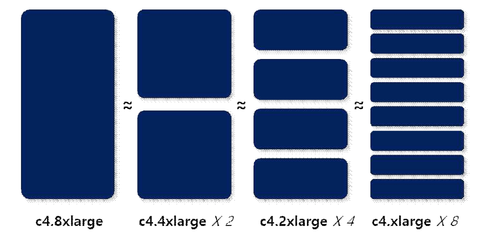

01.  Virtualization & EC2

## 01\. 가상화(Virtualization)와 EC2

### 01\. EC2(Elastic Compute Cloud)
1.  Amazon Elastic Compute Cloud(Amazon EC2)는 인터넷에 연결된 가상 서버를 제공하는 서비스이다.
2.  클릭 몇번으로 Linux 또는 Windows가 설치된 서버를 사용할 수 있기 때문에 실제 서버(On Premise)를 구축하는 것 보다 효율적이다.
3.  사용한 만큼 비용을 지불하기 때문에 비용 절감 효과도 있다.

### 02\. 가상화(Virtualization) 란?
소프트웨어(Hypervisor)를 사용하여 하나의 물리 머신(Host)에서 여러 ‘가상 머신(Guest)’을 만드는 기술이며 가상 머신들은 서로 격리되어 있으며 호스트 머신의 일부이다.
가상 머신은 실제 물리 서버와 동일하게 CPU, 메모리, 네트워크 인터페이스, 스토리로 구성된다.
하이퍼바이저의 역할은 가상 머신들을 서로 격리 시키고 하드웨어에 대한 요청을 스케쥴링 하는 역할을 한다.

### 03\. 아마존 머신 이미지(Amazon Machine Image, AMI)

1.  OS를 기본으로 서버 애플리케이션, 데이터베이스, 네트워크 설정(방화벽), 비즈니스 솔류션 등이 설치된 이미지이다.
2.  AWS에서는 기본적으로 사용자가 빈 EC2에 OS를 설치할 수 없다.
3.  AWS에서는 AMI를 이용하여 EC2 인스탄스를 생성하게 된다.

### 04\. 인스턴스(Instance)
#### 01\. 유형(Types)

​ AWS에서 컴퓨팅 파워는 인스턴스 유형으로 분류되어 있다. AWS를 인스턴스 유형을 다음과 같이 표기한다.

​ 1번은 인스턴스 패밀리(Instance Family)이다. AWS는 여러 유형의 패밀리로 인스턴스를 분류하고 그룹화 하였다. AWS는 새로운 인스턴스 유형의 패밀리를 출시 하기도 하지만 기존의 패밀리를 업그레이드하는 데 이때 2번의 세대(Generation)이라는 개념을 사용해 구분한다. 3번은 인스탄스 크기(Instance Size)이다. 인스턴스 크기는 CPU, 네트워크, 스토리지, 메모리의 성능을 정의한다.

​ 인스턴스 패밀리별 특징은 다음과 같다.

  1. 마이크로(T)
     가격이 가장 싼 인스턴스  낮은 vCPU 성는과 적은 메모리를 제공한다. 프리티어에서 무료로 사용할 수 있다.
     인스턴스 크기별 기본 수준의 vCPU 성능 제공
     간헐적으로 높은 성능이 필요할 때 유휴시간에 모아 놓은 크레딧을 기반으 로 버스팅하여 높은 성능을 제공
     적용사례 : 개발환경, 소규모 웹, 마이크로 서비스

  2. 범용(M)
 	 컴퓨팅, 메모리 및 네트워크 리소스를 균형 있게 제공
	 적용사례 : 중소형 DB, 기타 엔터프라이즈 애플리케이션
	 스토리지 최적화(D)
	 HDD 기반 높은 디스크 처리량 제공
	 적용사례 : MPP DW(대용량병렬처리 DW), MapReduce(분산 병렬 컴퓨팅)

  3. 메모리 최적화(R)
  	 메모리 사이즈가 크다.
	 적용사례 : 고성능 DB, 분산 메모리 캐시, 게놈 분석
 
  4. 메모리 최적화(X)
  	 메모리 사이즈가 크다.
     인-메모리 DB. 메모리 기반의 빅 데이터 처리 엔진 및 HPC(고성능 컴퓨 팅) 애플리케이션에 적합
     적용사례 : SAP HANA, Apache Spark, Presto

  5. 스토리지 최적화(I)
     SSD 기반의 초고속 랜던 I/O 성능에 최적화된 인스턴스 스토리지 제공
     적용사례 : NoSQL DB, DW(data warehouse), 하둡 및 분산 시스템

  6. 컴퓨팅 최적화(C)
     메모리 대비 vCPU 비율이 높다. 가장 높은 수준의 컴퓨팅 성능을 제공
     적용사례 : 고성능 프론트 엔드, 웹서버, 배치(일괄처리), 게임

  7. 가속화된 컴퓨팅(G, P, F)
     GPU 및 FPGA(Field-Programmable Gate Array 인류 역사상 가장 신뢰성\[1\]이 높은 프로그래밍이 가능한 집적회로 반도체)를 이용한 높은 컴퓨팅 애플리케이션
     적용사례 : 3D 앱 스트리밍, ML

​ 인스턴스 크기의 활용은 다음과 같다.

Auto Scaling(자동 수평 확장)은 모든 설정과 설치가 완료된 AMI를 이용하여 EC2 인스탄스를 신속하게 늘려가는 과정이다

#### 03\. 인스턴스 구매 옵션
​ 유연성을 위해 클라우드에서 가상 서버를 생성하고 실행한다. 이 때 발생하는 비용문제도 고려 대상이다. AWS에는 EC2 인스턴스에 다양한 유형도 제공하지만 구매 옵션(Purchasing Options)도 여러 가지가 준비되어 있다. 구매 옵션이 다양한 이유는 비용 절감 때문이다. 예를 들어 장기간 예약하거나 수요가 적은 시간에 인스턴스를 선택할 수 있는 구매 옵션을 개별적으로 이용하여 비용을 절감할 수 있다. AWS는 EC2 인스턴스 구매 및 과금 방식에 따라 3가지 구매 옵션을 제공한다. 비용 절감을 위해 고려해 볼 수 있는 것은 스팟 인스턴스 그리고 예약 인스턴스이지만 유연성은 다소 떨어질 수 있다.

#### 04\. 인스턴스 구매 옵션 종류
01. 온 디맨드 인스턴스(On Demand Instance)
	필요할 때 바로 생성해서 사용할 수 있는 방식이다.
	실행하는 시간을 기준으로 과금된다.
	1시간 단위로 이루어지며 1분을 사용했더라도 1시간으로 책정된다. 
	3가지 방식중 가장 비싼 구매 옵션이다.
	2 가지로 다시 구분 할 수 있다.
	- 공유 인스턴스(Shared Tenancy)
	  하나의 물리 서버에 여러 인스턴스가 자원을 공유한다. 
	- 전용 인스턴스(Dedicated Tenancy)
	  하나의 물리 서버에 하나의 인스턴스가 자원을 독점에 사용할 수 있지만 공유 인스턴스보다 가격은 비싸다.
	  
02. 스팟 인스턴스(Spot Instance)
	경매 방식의 인스턴스이다.
	인스턴스의 용량(스펙)을 미리 결정하고 원하는 가격을 입력하여 입찰하면 수요와 공급에 따라 가격이 결정되고 높게 입찰한 사람에게 인스턴스가 할당된다.
	이 옵션은 지속적으로 유지해야 하는 서비스가 아닌 클러스터링으로 이루어지는 데이터 분석작업, 이미지 변환, 비디오 렌더링, 웹 크롤링, 테스트 등의 단발성 작업에 인스턴스가 필요한 경우 적당하다.
	
04. 예약 인스턴스(Reserved Instance)
	예약금을 선불로 내면 인스턴스를 1년 이상 예약할 수 있다.
	시간당 요금이 크게 줄어드는 장점이 있다. 
	온 디맨드와 마찬가지로 공유 인스턴스, 전용 인스턴스로 나뉜다. 
	1년이상 장기 예약이지만 사용률에 따라 다음 세가지로 나뉘며 선결제 금액에도 차이가 있다. 자세한 것은 AWS 사이트의 요금표(http://aws.amazon.com/ko/ec2/pricing)를 참조한다.
	- Light
	  선결제 금액이 가장 저렴하다. 사용 기간이 길지 않을 때 선택하는 것이 바람직하며 1년 중 몇 달만 개발 및 테스트 할 계획이라면 고려 해 볼 만 하다. 
	- Medium
	  Light보다 선결제 금액이 비싸다. 비싸지만 시간당 요금은 저렴하다. 인스턴스가 항상 실행 중이지만 사용량에 다소의 변화가 있을 때 유용한 옵션이다.
	- Heavy
	  Medium보다 선결제 금액은 비싸지만 3가지 중 가장 시간당 요금은 저렴하다. 24시간 상시 가동되어야 하는 서비스가 출시된 경우라면 적합하다.

