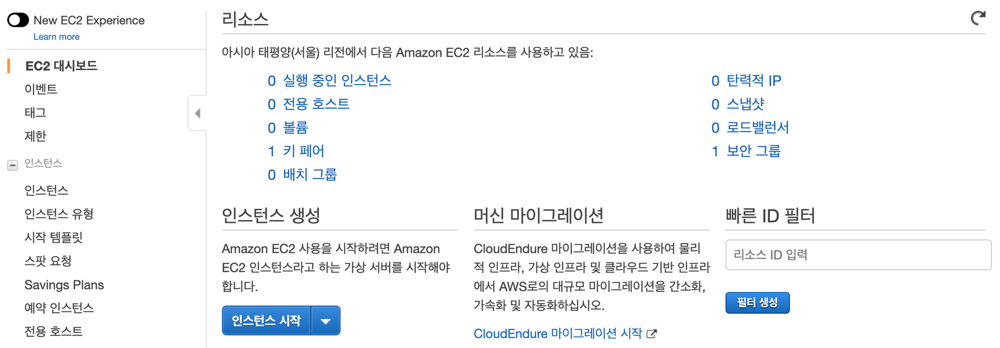
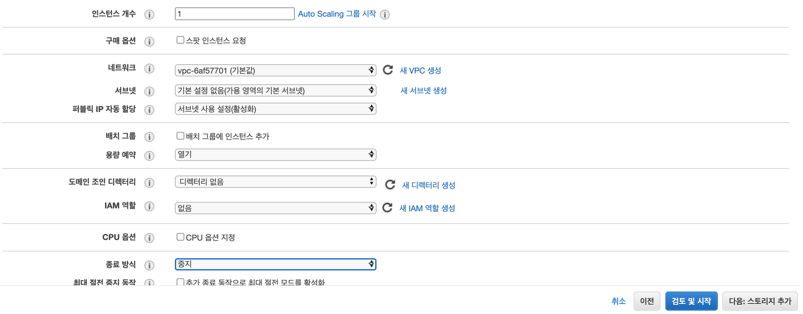
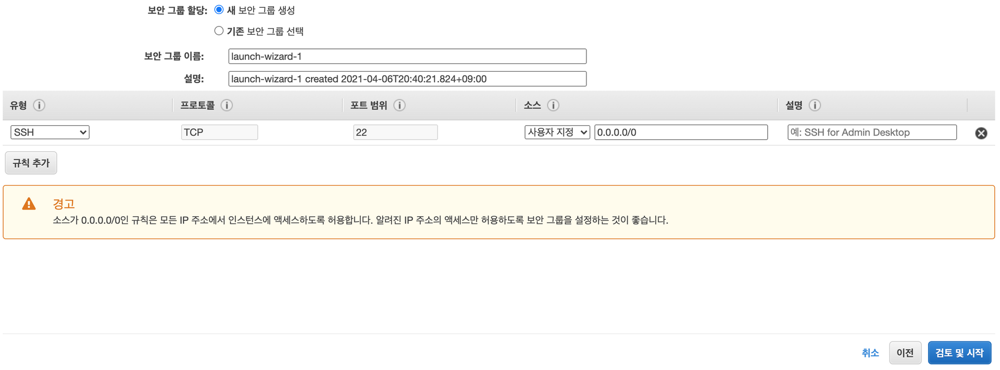
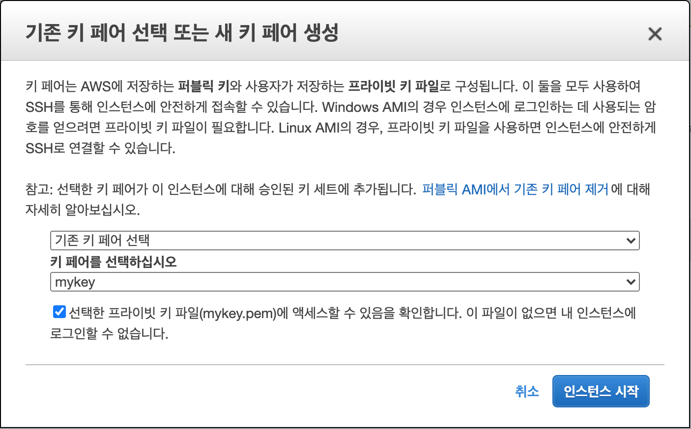
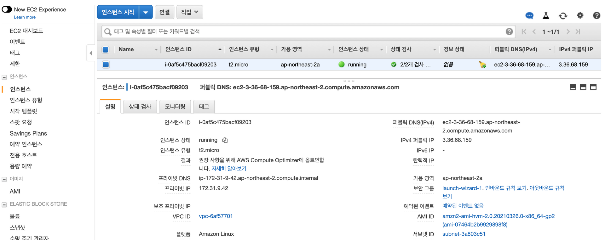

02. Launching Virtual Server

## 02\. 가상 서버 시작

### 01\. 마법사 시작

​ AWS에서 가상서버를 시작하기 위해서는 서비스에서 EC2를 선택하여 EC2 대시보드에서 인스턴스 시작(Lauch Instance) 으로 마법사를 시작한다. 다음 단계로 마법사를 실행한다.

1.  관리 콘솔 열기(https://console.aws.amazon.com)
2.  리전(Region) 확인하기
3.  탐색바(Navigation Bar)의 서비스에서 'EC2' 선택하여 'EC2 대시보드(Dashboard)'로 이동
4.  '인스턴스 시작(Launch Instance)' 버튼 클릭

### 02\. 마법사 단계

​ 마법사는 다음 단계에 따라 진행된다.

1.  AMI 선택: 1단계
    자신에게 맞는 OS와 소프웨어 등이 설치된 AMI를 선택한다. 프리티어를 체크하고 'Amazon Linux 2 AMI (HVM)', '64비트(x86)'를 선택하도록 한다.
    
	
	AWS는 다양한 AMI를 다양한 방법으로 제공하고 있다. 그림에서 보면, AWS 마켓플레이스(AWS Marketplace)에서는 특정 서드파티 소프트웨어가 미리 설치된 AMI를 제공하고 있다. 또한 커뮤니티 AMI(Community AMI)에서는 무료로 제공되는 다양한 AMI를 선택할 수 있다. 빠른 시작(Quick Start)에서는 이 두 곳의 가장 일반적이고 많이 사용하는 AMI를 모아 두었다. 한편, 사용자가 직접 AMI를 만들고 관리가 가능한데  나의 AMI(My AMI)에서 선택 가능하다.
    
2.  인스턴스 유형 선택: 2단계
    서버 크기 즉, 컴퓨팅 파워를 선택할 수 있다. 연습을 위해  가장 적고 저렴한 가상 서버를 선택한다. 인스턴스 유형을 't2.micro' 로 선택하고 다음 단계인 '인스턴스 구성(인스턴스 상세 설정, Configure Instance Details)' 으로 넘어간다.
    
    
3.  인스턴스 구성: 3단계
    인스턴스의 구성은 인스턴스 수, 네트워크, 서버 접근 제어(IAM), 셧다운과 모니터링 등 인스턴스 세부 정보를 설정한다. 이는 뒤에서 자세하게 다루고 지금은 기본 설정을 하도록 한다.
    
    
4.  스토리지 추가: 4단계
    AWS에서 데이터를 저장하는 방법은 여러 가지이다. 기본적으로 네트워크 연결 스토리지(Network Attached Storage, NAT)를 추가하며 설정은 기본을 유지하도록 한다.
    
    
5.  태그 추가: 5단계
    키-값 쌍의 태그를 자원에 붙혀 두면 나중에 찾기가 쉽고 관리가 쉬워진다. name을 키(key)로 하고 myserver를 값(value)으로 태그를 하나 추가 한다.
    
    
6.  보안 그룹(Security Group) 구성: 6단계
    가상 서버를 외부로 부터 보호할 방화벽 설정을 한다. 어디에서나 SSH를 통해 접근할 수 있도록 기본 방화벽 설정이 되어 있다. 실습에서는 기본값을 유지한다.
    
    
7.  검토 및 시작: 7단계
    6단계까지 선택하고 설정한 것을 검토한다. 실습에서는 AMI(OS)로 'Amazon Linux 2 AMI (HVM)' 그리고 인스턴스 유형으르 't2.micro' 가 잘 선택했는지만 확인하고 시작(Launch) 버튼을 클릭한다.
    
    
    시작 전에 마법사는 새로운 가상 서버의 키를 요청한다. 가입 과정에서 생성한 키 페어(mykey)를 선택하고 프라이빗 키 파일(mykey.perm)으로 액세스할 수 있음을 체크하고 인스턴스 시작(Launch Instance) 버튼을 누르면 인스턴스가 시작된다.
    
    
    인스턴스 보기(View Instance)를 클릭하여 EC2 대시보드에서 가상 서버가 'running' 상태가 될 때까지 기다린다.
    